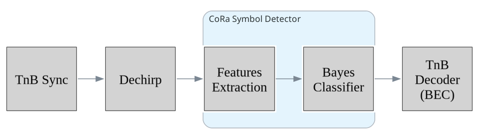
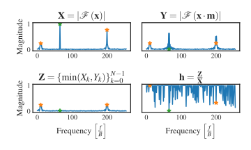
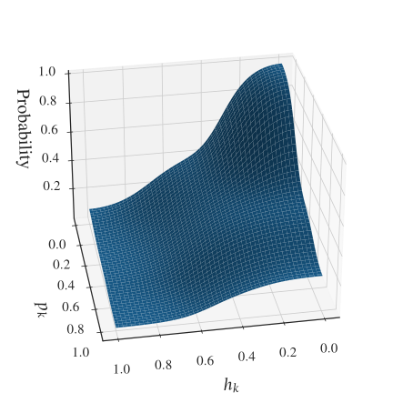
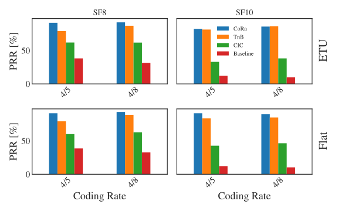

# CoRa'24 省流（代笔，2026-09-17，待用户读毕替换终评）

> Álamos, Makkes, Ding, Reyes, Walter, Cattrucci, Scheuermann, Aschenbruck.
> "CoRa: A Collision-Resistant LoRa Symbol Detector of Low Complexity".
> arXiv 2412.13930, 2024-12, TU Dresden（预印本，未见正式发表）. 代码/数据在 Zenodo.
> 复核与归档位置：本文档；风格仿 lora_sec/01_主线_幻影下行/论文阅读/省流_* 系列

## 省流之一：总评

这篇的定位很窄也很明确：标准 LoRa 接收机里"去斜 → FFT → 取 argmax"那一步，在碰撞下
取到的峰经常是干扰的假峰，于是它只把这一步换掉，其余全不动。思路是不去重构干扰、也
不去检测干扰的符号边界（CIC/TnB/CoLoRa/Paralign 都要），而是对每个 bin 算"这是个完整
波形的概率"，挑概率最大的 bin。

概率从两个特征查表来：

- **HPD（半周期判别器）**：对去斜后的信号再做一次"后半周期反相"的 DFT。真实符号是完整
  正弦，正负半周在反相变换下抵消 → 该 bin 第二变换≈0；碰撞把一个符号截成两半、拼不出
  完整周期 → 不抵消。真假峰在这个量上天然分开。
- **PMD（峰幅偏差）**：数据符号的峰幅度相对前导估出的期望幅度偏了多少，截断到 1。

似然不是推导的，是拿 10 万个仿真符号（最多 2 个干扰、功率 −15~13 dB、分数频偏 ±1/8
bin）离线统计 2D 直方图，运行时 O(1) 查表。另有一个小技巧：乘上 (1 − 上一符号该 bin
是完整波形的概率)，把干扰前导造成的"恒定位置假峰"排掉。

同步它不做，直接复用 TnB 的帧同步和 STO/CFO 估计（整数部分），解码也复用 TnB 的 BEC，
等于只贡献中间那个检测器。

## 省流之二：账面结果

复杂度 O(N log N)，两个 FFT 占一半时间，恒定 ~3× 基线、与干扰数无关（CIC 是
O(N log N·(1+2K))，TnB 的 Thrive 用 rlowess 串行回归、难并行）。200 MHz DSP 上
~64 µs/符号，占 1.024 ms 符号期的 6%，实时可行。

效果在 CIC/TnB 公开真实数据集 + ETU 仿真信道上测：CIC 数据集最好比 TnB 好 29%
（高 SNR、95 pkt/s），亚噪声区缩到 +6%，比 CIC 好 178%，峰值吞吐 11.53× 基线；
TnB 数据集 SF8 室内 +24%，SF10 户外缩到 7–15% 甚至统计持平；ETU 多径下 SF8 CR4/5
+12.3%、CR4/8 +5%，SF10 持平，而且强信道波动下它比 TnB/基线更脆（掉 8–4 个点）。

最值得记的点是：**把"检测碰撞符号"变成"给每个 bin 算完整波形后验"，用对称性这种
免费的结构信息替代对干扰的一切先验**。这个套路本身比它的数字更有启发。

**用户判断：待读毕补。**（女友提议视角：感觉可以和我们的过采样能量冗余相结合——
裁决见复核注记）

## 方法详解（2026-09-18 补，公式级；论文图存于 cora_assets/）

### 0. 链路位置

CoRa 只替换标准接收机里"去斜 → FFT → argmax"中的判决一步，同步与解码全部沿用 TnB：

自身设定为 chip 率采样 $F_s = B$，每符号 $N = 2^{\mathrm{SF}}$ 点，对每个符号做两次
$N$ 点 FFT（$X$ 与反相信号 $Y$），再查表打分。

### 1. 碰撞的系统模型

基啁啾 $x_0(t)=e^{j\pi\frac{B}{T_s}t^2}$，$T_s = 2^{\mathrm{SF}}/B$；携带数据的符号是
频移后的啁啾，去斜（乘共轭基啁啾）后成为纯音 $x_d(t)=A\,e^{j(2\pi f_m t+\theta)}$，
FFT 能量集中在 bin $f_m$——完整波形。

两包碰撞时，干扰符号相对目标符号边界偏移 $\Delta t$，目标窗口内的去斜信号为三段叠加：

$$
x_d(t)=\underbrace{A\,e^{j(2\pi f_m t+\theta)}}_{\text{完整波形（目标）}}
+\underbrace{B_1\,e^{j2\pi f_1 t}\,\mathbb{1}_{[0,\Delta t)}(t)}_{\text{截断波形}}
+\underbrace{B_2\,e^{j2\pi f_2 t}\,\mathbb{1}_{[\Delta t,T_s)}(t)}_{\text{截断波形}}
+\eta(t)
$$

干扰更强时 $f_1/f_2$ 处的峰压过 $f_m$ 处真峰，argmax 解错。特例：干扰前导在同一 bin
上叠两截截断波形，幅度上可伪装成完整波形，但它在符号间**固定位置重复**（数据符号因
白化乱跳）——这是第 5 节去相关项的靶子。

### 2. HPD（Half-Period Discriminator）

构造掩码 $m_n = +1\ (n < N/2)$、$m_n = -1\ (n \ge N/2)$，令 $y_n = x_n m_n$（后半
周期反相）。把 $Y_k$ 定义式中的后半段求和折到前半段：

$$
Y_k=\sum_{n=0}^{N/2-1}\Big(x_n-(-1)^k\,x_{n+N/2}\Big)\,e^{-j2\pi kn/N}
$$

关键在括号内。落在**整数 bin** $k_0$ 的完整波形满足半周期平移关系：

$$
x_{n+N/2}=e^{j\pi k_0}x_n=(-1)^{k_0}x_n
\;\Longrightarrow\; Y_{k_0}\equiv 0 \quad(\text{偶 bin 对称、奇 bin 反对称})
$$

截断波形躲不掉：音调只占半窗时 $x_{n+N/2}=0\ne\pm x_n$；两截不同频率时两个半周期转速
不同，关系同样不成立，$Y_k$ 显著非零。

特征定义（$\min$ 压掉真峰在 $Y$ 里的残留旁瓣，归一到 $[0,1]$）：

$$
h_k=\frac{\min\big(|X_k|,\ |Y_k|\big)}{|X_k|}
$$

**脆点（对我方最重要的公式）**：分数 CFO/STO 使频率变成 $k_0+\delta$（$\delta$ 非整
数）时 $x_{n+N/2}=(-1)^{k_0}e^{j\pi\delta}x_n$，残留相位因子 $e^{j\pi\delta}$ 破坏严格
抵消——真峰自己的 $h$ 被抬高，真假峰在 HPD 上重新糊住。论文靠训练掺 $\pm\tfrac18$
bin 分数偏移"忍"，不修。

### 3. PMD（Peak Magnitude Deviation）

$$
p_k=\min\!\left(\frac{\big|\,|X_k|-\mathbb{E}[|X_p|]\,\big|}{\mathbb{E}[|X_p|]},\ 1\right)
$$

$\mathbb{E}[|X_p|]$ 为期望峰幅度，取同步阶段前导各符号峰幅度均值。目标符号与前导同为
完整波形、幅度量级一致 → 真峰 $p\approx 0$；噪声 bin 幅度过小、截断干扰能量被切走
→ $p$ 大。失效场景：干扰功率 $\approx$ 前导量级（幅度无区分度）、低 SNR 前导估计被污染。

### 4. 贝叶斯后验：离线烧表

对每个 bin 取特征对 $\mathbf{hp}_k=(h_k,\,p_k)$：

$$
P\big(C_k(x)\mid\mathbf{hp}_k(x)\big)=
\frac{P\big(\mathbf{hp}_k\mid C_k\big)\,P(C_k)}{P\big(\mathbf{hp}_k\big)},
\qquad C_k=\text{“bin } k \text{ 上是完整波形”}
$$

似然不推导、直接统计：10 万个仿真去斜符号（256 bin，即 SF8），每个含 1 个真完整波形
+ 最多 2 个干扰包（各贡献两截截断波形，频率、位置均匀随机），干扰功率
$\sim\mathcal{U}[-15,13]$ dB，另加 $\pm\tfrac18$ bin 均匀分数频偏模拟同步残差，且刻意
聚焦"基线解调器会解错"的难符号。采样两个讲究：真类只收真 bin 的 $(h,p)$；干扰类每符号
只留 $p_k$ 最小的 10 对——**强迫分类器不能光靠 PMD，必须用上 HPD 的判别力**。两类各做
平滑 2D 直方图存成离散似然，先验 $P(C_k)$ 取真样本占比；运行时 200×200 网格最近邻查表
（O(1)/bin，内存受限可换样条近似）。

### 5. 前符号去相关与判决

干扰前导的两截截断波形叠加能同时骗过 HPD 与 PMD（对称、幅度正常），但骗不过时间：同一
bin 上符号间重复。最终得分：

$$
P(T_k)=P\big(C_k(x)\mid\mathbf{hp}_k(x)\big)\cdot
\Big(1-P\big(C_k(x')\mid\mathbf{hp}_k(x')\big)\Big)
$$

$x'$ 为上一符号；上一个符号同一 bin 也像完整波形 → 当前 bin 更可能是干扰前导驻留假峰，
扣分。判决：

$$
k^{*}=\arg\max_{k}\;P(T_k)
$$

全 bin 打分取最大——不做峰检测、不设阈值、不需要干扰边界信息。硬判决符号流进 TnB 的
BEC 解码器（Hamming + CRC）。

### 6. 复杂度与失效面

每符号 2 次 $N$ 点 FFT（≈50% 运行时间）+ 每 bin O(1) 查表（≈30%）+ 去斜（≈15%），
合计恒定 ~3× 基线、与干扰包数 $K$ 无关（对比 CIC 的 $O(N\log N\cdot(1+2K))$；TnB 的
Thrive 用 rlowess 串行回归难并行）。200 MHz DSP 上 ~64 µs/符号 ≈ 符号期 6%。

论文自认的失效面：①分数偏移削弱 HPD 抵消（见第 2 节推导）；②干扰功率 $\approx$ 前导
时 PMD 无区分度、低 SNR 前导估计被污染；③ETU 多径 + 多普勒下比 TnB/基线掉 4–8 个点
PRR——衰落同时破坏"期望幅度"与"对称性"两个前提，作者把衰落信道下的特征改进列为
future work。**一切特征默认"对齐到整数 bin + 幅度有干净参考"——恰分别是 OSR 相干合并
与 PC-Ridge 相干前导能供给的东西。**

## 助手复核注记（2026-09-17）

- 出处核实：非 SIGCOMM（搜索结果里有拼接错误）；arXiv 预印本，被引约 8 次，引用时
  标 preprint。
- 女友提议裁决：**方向成立，接口真实**。CoRa 自己承认的弱点——分数 STO/CFO 破坏 HPD
  的半周期抵消、低 SNR 下特征退化、只能靠训练掺 ±1/8 bin 容忍——恰好是我方 Savaux
  OSR 分支相干合并最强的区域（我方基线：−22 dB SER 0.603→0.005，见
  notes/baselines/PAPER_OVERSAMPLED_DEMOD_BASELINE_2026-06-17.md）。三个具体接口：
  ①OSR 合并先对齐分数偏移再算 HPD/PMD；②过采样能量核形状做第三特征（它完全没用）；
  ③PC-Ridge 相干前导给 PMD 提供干净幅度基准。
- 但它是碰撞线，与我方当前 sync 主线不接壤（它同步直接用 TnB 的）；单纯"CoRa+过采样"
  在拥挤赛道里偏增量，delta 应落在"分数偏移鲁棒 + 低 SNR 特征不退化 + 复杂度仍
  O(N log N) 量级"的组合上。复杂度核算注意：分支合并后 ~3× 会变 ~3R×。
- 已建议一两天量级可行性实验：在 savaux_oversampled 现有代码旁加 HPD（第二次反相 DFT），
  对比中心抽取 FFT vs OSR 合并两种前端下真假峰的 HPD 区分度。当前论文硬前置仍是
  检测级联，此线只记不做。
- 图片归档（2026-09-18）：8 张原文图存 cora_assets/。取图踩坑记录：arXiv HTML 的
  x*.png 导出名与图号**不按顺序对应**（x2.png 实为 Fig.6 吞吐四联图，视觉核验过）；
  HTML 版 Fig.6 资源缺失（ltx_missing），用该 x2 导出顶替；Fig.2 是内嵌 SVG，从页面
  源码 S2.F2 节点提取；其余按标签名直接下载（system.png / hpd_derivation.svg /
  posterior_probability.svg / TnB_dataset.svg / sim_dataset.svg / complexity.svg）。
  Fig.1（去斜基本示意）未取。
